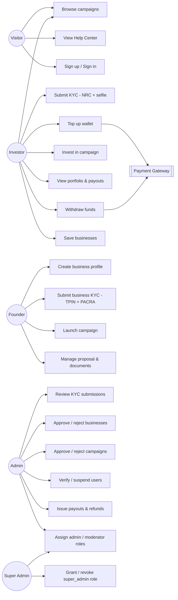
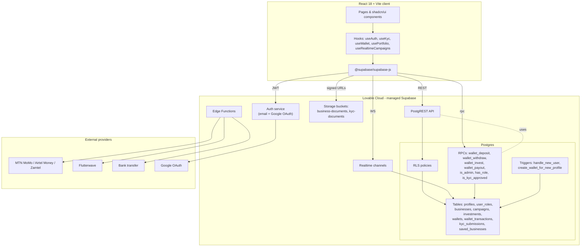
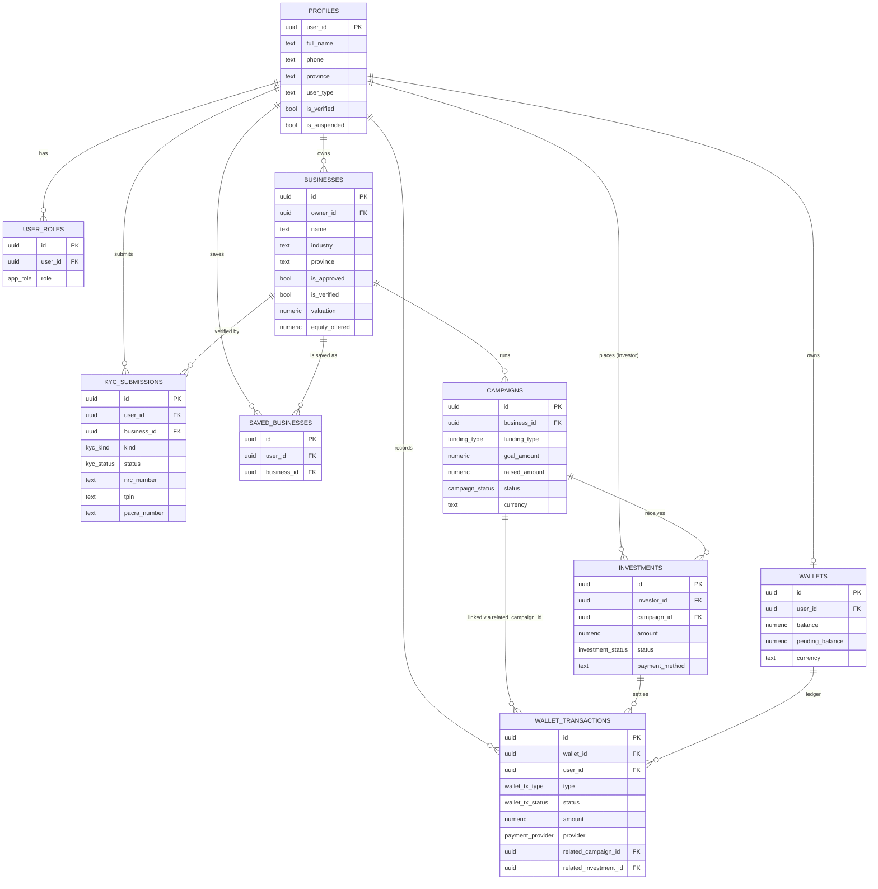
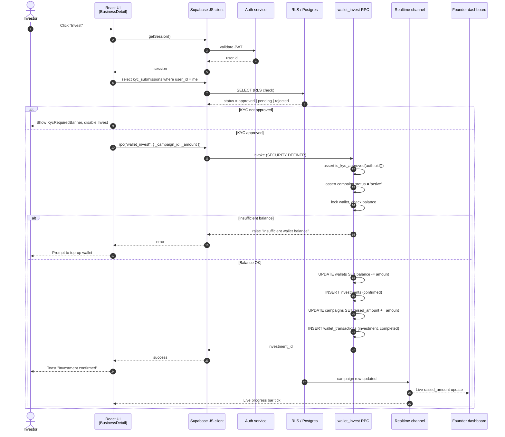

# ZamFund — Zambia Fund Hub

ZamFund is a Zambian-first investment marketplace that connects local startups
and SMEs with retail and diaspora investors. Founders raise capital through
equity, revenue-share, loan, or crowdfunding campaigns, while investors browse
verified opportunities, fund campaigns from an in-app wallet, and track returns.

> **Live preview:** https://zambia-fund-hub.lovable.app

---

## Table of Contents

1. [Feature overview](#feature-overview)
2. [User roles](#user-roles)
3. [Demo accounts](#demo-accounts)
4. [Technology stack](#technology-stack)
5. [Local setup](#local-setup)
6. [Project structure](#project-structure)
7. [Backend & database](#backend--database)
8. [Security model](#security-model)
9. [Testing](#testing)
10. [Deployment](#deployment)
11. [System diagrams](#system-diagrams)
    - [Use-case diagram](#use-case-diagram)
    - [UML component diagram](#uml-component-diagram)
    - [Entity-relationship diagram](#entity-relationship-diagram-erd)
    - [Sequence diagram — invest in a campaign](#sequence-diagram--invest-in-a-campaign)

---

## Feature overview

| Area | What's implemented |
|------|--------------------|
| **Authentication** | Email/password sign-up & sign-in, Google OAuth, password reset by email, profile auto-provisioned via DB trigger |
| **KYC compliance** | Individual (NRC + selfie) and business (TPIN + PACRA) submissions, admin review (approve/reject with notes), hard-gate on investments until approved |
| **Wallet** | ZMW wallet per user, deposits via MTN MoMo / Airtel Money / Zamtel Kwacha / bank transfer / Flutterwave, withdrawals, internal investment debits, payouts/refunds — all through `SECURITY DEFINER` RPCs |
| **Discovery** | Browse approved businesses, discovery rails (trending / new / closing soon), risk scoring, real-time campaign progress bars, save/bookmark businesses |
| **Founder dashboard** | Create business profile, upload registration & pitch deck, launch campaigns (4 funding types), edit proposals, track raised amount in real time |
| **Investor dashboard** | Wallet card, portfolio summary, investment list with status, campaign urgency badges, saved businesses |
| **Admin dashboard** | Tabs for Users, KYC, Businesses, Campaigns, Investments, Transactions; verify/suspend users; approve/reject businesses & campaigns; issue payouts/refunds |
| **Super admin** | All admin powers + grant/revoke the `super_admin` role |
| **Realtime** | Supabase Realtime subscription on `campaigns` for live funding updates |
| **Help center** | Public, searchable FAQ at `/help` covering KYC, funding models, wallet, and fees |

## User roles

The `app_role` enum has four values: `user`, `moderator`, `admin`, `super_admin`.
Roles live in a dedicated `user_roles` table (never on `profiles`) to prevent
privilege-escalation attacks. A SQL helper `public.is_admin(uuid)` resolves both
admin tiers in one call and is used inside every RLS policy that needs admin
access.

## Demo accounts

Pre-seeded, email-confirmed accounts are available for testing. The Auth screen
includes a one-click "Demo accounts" panel.

| Role | Email | Password |
|------|-------|----------|
| Super admin | `superadmin@zamfund.test` | `SuperAdmin#2026` |
| Admin | `admin@zamfund.test` | `Admin#2026` |
| Founder | `founder@zamfund.test` | `Founder#2026` |
| Investor | `investor@zamfund.test` | `Investor#2026` |

## Technology stack

- **Frontend:** React 18, TypeScript 5, Vite 5
- **Styling:** Tailwind CSS 3 + shadcn/ui (Radix primitives), Framer Motion, semantic HSL design tokens
- **Routing:** React Router v6
- **Forms:** React Hook Form + Zod
- **Data layer:** TanStack React Query, Supabase JS client v2
- **Backend:** Lovable Cloud (managed Supabase) — Postgres, Auth, Storage, Realtime, Edge Functions
- **Charts:** Recharts
- **Tests:** Vitest + Testing Library + jsdom
- **Tooling:** Bun (preferred) or npm, ESLint, lovable-tagger

## Local setup

The project runs on **Bun** (npm also works).

```sh
# 1. Clone
git clone <YOUR_GIT_URL> && cd zambia-fund-hub

# 2. Install
bun install

# 3. Environment variables
# .env is auto-managed by Lovable Cloud and contains:
#   VITE_SUPABASE_URL
#   VITE_SUPABASE_PUBLISHABLE_KEY
#   VITE_SUPABASE_PROJECT_ID
# Do not edit .env manually if you use Lovable Cloud.

# 4. Start dev server (http://localhost:5173)
bun run dev
```

### Available scripts

```sh
bun run dev          # Vite dev server with HMR
bun run build        # Production build
bun run build:dev    # Development-mode build (source maps)
bun run preview      # Serve the production build locally
bun run lint         # ESLint
bun run test         # Run Vitest once
bun run test:watch   # Vitest watch mode
```

## Project structure

```
src/
├── pages/                      # Route-level pages (Index, Auth, Browse,
│                               # BusinessDetail, Dashboard, Admin, Help, ResetPassword)
├── components/
│   ├── admin/                  # Admin dashboard tabs (users, KYC, payouts, …)
│   ├── browse/                 # Discovery rails
│   ├── dashboard/              # Sidebar layout & dashboard cards
│   ├── kyc/                    # KYC forms, badges, gating banners
│   ├── landing/                # Marketing sections
│   ├── portfolio/              # Investment cards & summary
│   ├── wallet/                 # Wallet card, deposit/withdraw dialogs
│   └── ui/                     # shadcn/ui primitives
├── hooks/                      # useAuth, useKyc, useWallet, usePortfolio,
│                               # useRealtimeCampaigns, useSavedBusinesses, …
├── integrations/supabase/      # Auto-generated client + types (DO NOT EDIT)
├── lib/                        # riskScore, utils
└── test/                       # Vitest setup & examples
supabase/
├── migrations/                 # Versioned SQL migrations
└── config.toml
```

## Backend & database

Core tables:

- `profiles` — display data (name, phone, province, avatar, `is_verified`, `is_suspended`)
- `user_roles` — role assignments (`user`, `moderator`, `admin`, `super_admin`)
- `businesses` — founder-owned entities awaiting `is_approved`
- `campaigns` — fundraising rounds (`equity` | `revenue_share` | `crowdfunding` | `loan`) with `raised_amount` updated transactionally
- `investments` — confirmed pledges linking investor → campaign
- `wallets` & `wallet_transactions` — ZMW balances and ledger
- `kyc_submissions` — `individual` or `business`, with status `not_submitted` / `pending` / `approved` / `rejected`
- `saved_businesses` — investor bookmarks
- `transactions` — legacy payment ledger

Key Postgres functions (all `SECURITY DEFINER`, `search_path = public`):

| Function | Purpose |
|----------|---------|
| `handle_new_user()` | Trigger that creates a `profiles` row on signup |
| `create_wallet_for_new_profile()` | Trigger that creates a wallet on profile creation |
| `is_admin(uuid)` / `has_role(uuid, app_role)` / `is_kyc_approved(uuid)` | RLS helpers — EXECUTE revoked from `anon` / `authenticated` |
| `wallet_deposit / wallet_withdraw / wallet_invest / wallet_payout` | Authoritative wallet operations |

Storage buckets:

- `business-documents` (private) — registration, pitch decks
- `kyc-documents` (private) — NRC, selfie, PACRA certificates

## Security model

- **Row-Level Security** is enabled on every table. Reads/writes are scoped to the owner or to admins via `is_admin(auth.uid())`.
- **Roles are never client-trusted.** The UI reads roles from `user_roles`, but every privileged action is re-checked server-side by RLS or RPC.
- **KYC gating** is enforced inside `wallet_invest`, so an attacker bypassing the UI still cannot pledge funds without an approved KYC.
- **Internal helpers** (`is_admin`, `has_role`, `is_kyc_approved`, triggers) have `EXECUTE` revoked from `anon` / `authenticated`; they only run inside RLS / other DB functions.
- **Wallet RPCs** (`wallet_deposit`, `wallet_withdraw`, `wallet_invest`, `wallet_payout`, `log_error`) are intentionally callable by signed-in users — they are the authoritative entry points and enforce auth, KYC, balance, and admin checks internally. The Supabase linter flags these by design; the warnings are an accepted, documented exception.
- **Leaked-password protection** (HIBP) is enabled at the auth layer, so users cannot pick passwords known to be compromised.
- **Auth state** is hydrated via the `useAuth` hook, which subscribes via `onAuthStateChange` _before_ calling `getSession()` and uses `.maybeSingle()` to avoid infinite loops.
- **Admin error log** (`error_logs` table + `log_error` RPC) captures failed RPCs, RLS denials, render crashes, and payment errors for review under Admin → Errors.

## Performance & caching

The app is a static SPA served behind the Lovable Cloud edge — there is no
custom server tier to scale. Optimisations are split between the platform
(which we rely on) and the application (which we control).

**Provided by the Lovable Cloud platform:**

- Global CDN for the static bundle (HTML/JS/CSS/assets) with HTTP caching headers.
- Postgres connection pooling, automated backups, and PITR for the database.
- Auto-scaled PostgREST, Auth, Realtime, and Storage tiers — no servers to provision.
- TLS termination, DDoS protection, and edge routing.

**Implemented in the application:**

- **Route-level code splitting** (`React.lazy` + `Suspense` in `src/App.tsx`) so each page ships as its own chunk and the landing page stays small.
- **React Query defaults** tuned for this workload: `staleTime: 30s`, `gcTime: 5min`, exponential-backoff retries (skipped for 4xx), `refetchOnWindowFocus: false` (Realtime supplies live updates).
- **Realtime subscriptions** on `wallets`, `wallet_transactions`, and `campaigns` — the client never polls; mutations flow through subscriptions.
- **Atomic wallet operations** via `SECURITY DEFINER` RPCs that take row-level locks (`FOR UPDATE`) — no read-modify-write races from the client.
- **Targeted database indexes** on every hot query path:
  - `campaigns(status)`, `campaigns(business_id)`, `campaigns(status, created_at DESC)`, partial index on `end_date WHERE status='active'`
  - `investments(investor_id, created_at DESC)`, `investments(campaign_id)`
  - `businesses(owner_id)`, partial index on `is_approved WHERE is_approved=true`
  - `user_roles(user_id)`, `kyc_submissions(user_id)`, `saved_businesses(user_id)`, `transactions(user_id, created_at DESC)`
  - `wallet_transactions(user_id, created_at DESC)`, `wallet_transactions(wallet_id, created_at DESC)`
- **Top-level `ErrorBoundary`** (`src/components/ErrorBoundary.tsx`) catches render-time crashes, forwards them to `error_logs`, and shows a recoverable fallback instead of a white screen.
- **Lazy media** — pitch decks and KYC documents are served via signed Storage URLs only when an authorized user opens them.

### Architectural assumptions

- The frontend is **stateless**: all session state lives in Supabase Auth (JWT in `localStorage`) and all domain state lives in Postgres. Any edge node can serve any user.
- **No client-side secrets.** The `.env` only carries the publishable anon key plus public URLs; service-role access stays inside `SECURITY DEFINER` functions and edge functions.
- **Single source of truth** for money flows is the `wallets` row plus the `wallet_transactions` ledger — derived totals (e.g. `campaigns.raised_amount`) are written transactionally inside `wallet_invest` / `wallet_payout`.
- **Scaling path:** when traffic grows, increase the Lovable Cloud instance under **Backend → Advanced settings**; no application changes are required.

## Testing

```sh
bun run test
```

Tests use Vitest with a jsdom environment and Testing Library matchers. The
suite under `src/test/smoke.test.ts` exercises sign-in, role assignment, admin
verification toggles, dashboard data loading, and error-log recording end to
end against a mocked Supabase client.

## Deployment

The app is deployed via Lovable. To publish, open the project in Lovable and
click **Publish**. Frontend changes require an explicit publish; backend
changes (migrations, edge functions, auth config) deploy immediately.

For self-hosting, any static host works:

```sh
bun run build       # outputs to dist/
# upload dist/ to Vercel / Netlify / Cloudflare Pages / S3+CloudFront
```

The Supabase backend is provisioned automatically by Lovable Cloud — no
separate deployment is required. Custom domains are configured in the Lovable
Project Settings → Domains panel.

---

## System diagrams

### Use-case diagram

Shows the major actors and the actions each can perform.



### UML component diagram

High-level system architecture and how the React client, Lovable Cloud
backend, and external providers interact.



### Entity-relationship diagram (ERD)

Core data model. PK = primary key, FK = foreign key (logical — some are
enforced in code rather than via DB constraints to keep migrations flexible).



### Sequence diagram — invest in a campaign

End-to-end flow when an investor pledges into a campaign. Shows the KYC hard
gate and the atomic wallet debit performed inside `wallet_invest`.


